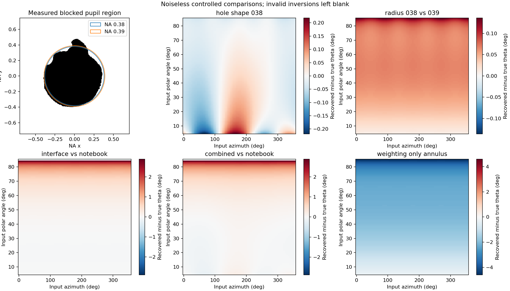
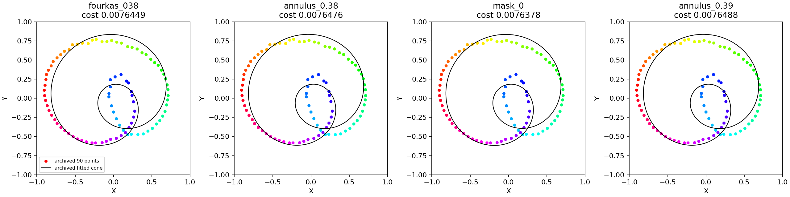

# Restored BFM fit and pupil comparison — 4 October 2026

## Findings

The original six-parameter background-only shape fit has been restored in
`anisotropy_rotation_processing.ipynb`. On the supplied sample, changing the
circular hole to the image-derived hole barely changes the real-data fit.
The main fit mismatch survives both models. Optical weighting, optimizer
behaviour and background physicality require more attention than this hole's
small departure from circularity.

This is a baseline recovery and pupil sensitivity study. It does **not** implement
or validate a background-plus-interference correction, nor establish true rod angles.

## Inputs and provenance

- Analysis repository base: `eeaf8303ec1bee0cdaf303208fb32b5b8f6da0c7`.
- Fit source: `9b3604e:Fourkas_processing_v4.ipynb`, zero-based cell 25.
  The replacement by a duplicate calibration cell is present in the renamed
  notebook at `939b5bd`; clearing its outputs later did not restore the code.
- Data: `files3_first40s.tdms`, SHA256
  `322375c1886144c8f1f5d5614526ad64b73601826c57b26777651824e411dd04`.
  Four DAQmx channels, 10,000,000 samples each, 250 kHz, 40 s. Metadata identifies
  scaled units as **Volts**, not photon counts. No electronic dark measurement
  was supplied; zero DAQ scaling intercept is not proof of zero detector offset.
- Thesis sources inspected: sections 1.5, 1.6 and 1.7, plus
  `analysis/optics_simulation.py` and `analysis/image_mirror_binary.tif`, at
  `haibaraaaaai/thesis@7576b50c356105cd51968d7ca5d61052e89768cf`.
  The current chapter 1.6 text and figure caption both say inner NA approximately
  0.38. The image has area-equivalent inner NA **0.3813389**. We also tested 0.39.
- TIFF metadata: array axes `x,y` (not normal image `row,column`); centre
  `(217,230)`; scale `1.4/235 mm/pixel`; outer pupil radius `2.4 mm`; 255 is blocked.
  Its blocked-area centroid is offset from the optical centre by approximately
  `(-0.02071,-0.00816)` in NA coordinates. Its laboratory angular registration
  and applicability to this acquisition remain unverified.

The private thesis source files and mask are not copied into this repository.
Supply your local mask path when reproducing the calculation.

## Notebook recovery and execution

The historical optimizer and bounds were retained. The notebook now defaults
to the supplied relative data path and the requested manual cycle `[0,700]`.
The output-path code was fixed to support a file in the repository root.
Comments asserting photon-counting noise and guaranteed geometry recovery at
background bounds were corrected. Inverse-Hessian values are labelled as
uncalibrated curvature diagnostics, not confidence intervals.

The fit window is **30–31 s**. Channel acquisition order remains
`ai0=90, ai1=45, ai2=135, ai3=0`; the matrix's physical order is
`0,90,45,135`. Gains precede the inverse T matrix. Historical beta `+0.009`
and the `/8` overall scaling are unchanged. Baseline annulus: NA 0.38–1.3,
water index 1.33. The notebook's effective NA 1.28671 is inactive on this branch.

Core execution covers loading, SCMS, manual cycle, phase lattice, gain/T
correction, restored fitting, all 40 s of phase tracking, and speed overview
plots. Phase tracking returns 1,000,000 points at decimation 10. This is an
execution result, not validation of speed or absolute angle. Archived step
searches and later exploratory/interactive sections are excluded. The later
Allan cell was attempted but requires an absent separate file,
`2024_08_01_fixed_gold/fixed/fixed7.tdms`; the reusable core runner skips it.

All 90 fit points were unique and remained positive after the fitted
background subtraction. Historical result:

| Quantity | Result |
|---|---:|
| Axis polar angle | 56.780 degrees |
| Axis azimuth | 61.429 degrees |
| Cone half-angle | 70.351 degrees |
| dc | 0.101700 |
| fa | 0.116454 |
| fb | -0.207639 |
| Shape cost | 0.0214077 |
| Final L-BFGS-B status | ABNORMAL / unsuccessful |

These angles are **not recommended estimates**: the optimizer status and
subsequent joint refits show that the alternating algorithm did not reach the
best solution found under its own model. The inherited finite-difference
Hessian is especially unsuitable as an uncertainty estimate here.

## Optical model and the weighting correction

We independently construct the water-side dipole far field, resolve radial p
and azimuthal s components, apply real water/oil Fresnel amplitude transmissions,
rotate the transmitted field through an ideal objective and integrate analyser
intensities on a uniform Cartesian BFP grid. Water index is 1.33; oil index is
1.51; outer NA is 1.3. Each channel is represented by a positive quadratic form
`I_i = d.T Q_i d` in the real unit dipole direction, with channel order
`0,90,45,135`. This makes arbitrary cone evaluations inexpensive.

The power transmission factor for each plane-wave component is
`n_o cos(theta_o)/(n_w cos(theta_w)) * |t|^2`. The sine-condition pupil mapping
has `dA_BFP proportional to n_w^2 cos(theta_w) dOmega_w`. Thus, up to an
orientation-independent constant, the required field weight is

`sqrt(cos(theta_o)) / cos(theta_w)`.

The inherited script instead weights fields by `1/cos(theta_o)`. The two
weights are implemented as separate models; no hole-shape comparison mixes
them. Without an interface, the correct weight reduces to `1/sqrt(cos(theta))`.

Assumptions: propagating far field; flat interface; ideal objective; no
near-field/interface-induced change of the source dipole, supercritical
collection, spatial detector clipping, aberration, interference or noise.
The model does not simulate the excitation field. A common excitation factor
cancels from instantaneous anisotropies, but would be needed for a full
absolute-intensity fit and finite-exposure motion averaging.

## Controlled simulation results

The table uses a **uniform test grid**, theta 5–85 degrees in 1-degree steps and
phi 0–355 degrees in 5-degree steps, not an isotropic orientation distribution.
Theta is recovered pointwise with the assumed circular model. Invalid inversions
are left invalid, not clipped. RMS/max theta errors exclude those invalid points.

| Simulated truth → reconstruction model | RMS change in (X,Y) | Theta RMS | Max absolute theta error | Invalid theta |
|---|---:|---:|---:|---:|
| Measured hole → annulus 0.38, same corrected interface | 0.000946 | 0.047 degrees | 0.218 degrees | 0% |
| Measured hole → equal-area annulus, same corrected interface | 0.000943 | 0.046 degrees | 0.218 degrees | 0% |
| Measured hole → annulus 0.39, same corrected interface | 0.001150 | 0.071 degrees | 0.228 degrees | 0% |
| Annulus 0.38 → annulus 0.39, same corrected interface | 0.000742 | 0.061 degrees | 0.136 degrees | 0% |
| Corrected-interface annulus 0.38 → notebook homogeneous annulus | 0.003133 | 0.608 degrees | 2.896 degrees | 1.23% |
| Corrected weighting → legacy weighting, same interface and annulus | 0.024144 | 2.125 degrees | 4.600 degrees | 0% |

For the hole-only comparison, the largest errors in this grid occur near the
pole: maximum azimuth error is approximately 2.75 degrees at theta 5 degrees,
versus approximately 0.24 degrees at theta 25 degrees. The apparent small
theta errors do not remove pole/equator conditioning. At the equator, small
anisotropy errors can yield invalid or strongly biased theta inversions.

Representative corrected-interface annulus signals inverted with the notebook
model give approximately 29.985 degrees for true 30, 55.172 for true 55, and
75.811 for true 75. At true 85 the inferred sin-squared theta is approximately
1.00047 and is deliberately not converted to a clipped 90-degree result.



## Real-data sensitivity refits

For each model we kept the same 90 selected channel samples, inherited matrix,
estimated gains and background parameterisation. We used joint six-parameter
differential evolution with seeds 42 and 91, then a Powell polish. All points
must remain positive: the refits cannot lower their cost by discarding samples.
The objective otherwise retains the historical arc-length resampling and
leftmost-point anchoring. It is a geometric loss, **not** a noise likelihood.

| Model | Best shape cost | Folded theta range from fitted cone |
|---|---:|---:|
| Notebook homogeneous annulus 0.38 | 0.00764488 | 24.445–72.382 degrees |
| Corrected-interface annulus 0.38 | 0.00764761 | 24.542–71.968 degrees |
| Corrected-interface measured hole | 0.00763778 | 24.570–71.919 degrees |
| Corrected-interface annulus 0.39 | 0.00764884 | 24.592–72.037 degrees |

Both random seeds converged for each model. Tiny differences between nearby
solutions remain because the curve anchoring/resampling objective is nonsmooth.
Changing the optimizer lowers the notebook cost by about 64%; replacing the
interface annulus with the measured hole lowers it by only about 0.13%.
Residuals remain visibly structured.

All four fits drive `fb` to -1. Their background anisotropy magnitude
`sqrt(fa^2+fb^2)` is approximately **1.197**, exceeding 1. A common physical
optical background must obey the Stokes inequality `fa^2+fb^2 <= 1`, not merely
the inherited separate bounds `abs(fa),abs(fb) <= 1`. These fits are therefore
effective offsets, not admissible estimates of that optical background.
Calibration errors, detector offsets and unmodelled interference can be absorbed
into such parameters; this result does not identify which explanation is correct.



Time-ordered points sampled at 1 ms outside 30–31 s have nearest-cone RMS
anisotropy residual approximately 0.0992 for every model, with all sampled
channels remaining positive after correction. This is a held-out geometric
check, not an independent theta calibration or a test of temporal phase prediction.

## Verification

- Homogeneous-medium numerical annulus agrees with analytic Fourkas anisotropy
  to a maximum vector discrepancy below 0.00005 on the test grid.
- Pair sums agree to relative numerical error below 6e-14.
- Integrated channel matrices are positive semidefinite and preserve d/-d symmetry.
- Increasing pupil radius from 480 to 960 grid pixels changes the measured-hole
  anisotropy by at most 0.0000383; hole-only theta RMS changes from 0.04737 to
  0.04689 degrees. The effect hierarchy is stable at this resolution.
- The independent legacy-weight implementation agrees with the original script
  at three representative orientations to better than 0.00005 per anisotropy
  component, within the different grid sampling.
- Mask rotations 0,45,90,135 degrees give similar aggregate hole-only errors.
  This is not a measurement of the mask's actual registration or later alignment drift.

## Reproduce

From the repository root, with NumPy, SciPy, Matplotlib, Pillow, npTDMS and
nbformat installed:

```bash
OPENBLAS_NUM_THREADS=1 python analysis/pupil_comparison/run_notebook.py
OPENBLAS_NUM_THREADS=1 python analysis/pupil_comparison/compare_pupils.py --mask /path/to/thesis/analysis/image_mirror_binary.tif
OPENBLAS_NUM_THREADS=1 python analysis/pupil_comparison/refit_models.py
```

Outputs go to `analysis/pupil_comparison/results/` (ignored large/intermediate
artifacts). `report/` contains the compact recorded outputs from this run.
`verify_models.py` additionally uses the recorded 960-pixel convergence check;
the associated recipe is in `check_fine_grid.py`.

## Handoff / next decisions

1. Keep the recovered historical fit as a reproducibility baseline; do not use
   its Hessian values or current fitted angles as evidence of absolute accuracy.
2. Use the corrected-interface annulus as the economical optical model for the
   next background/interference work, with this measured mask as a sensitivity
   check. This conclusion is specific to the supplied mask and scale.
3. Resolve calibration and enforce physical optical-background constraints before
   interpreting fitted offsets. Preserve electronic offsets separately.
4. Retain the fixed BFM cone provisionally, but check the ridge/smoothing/selection
   and geometric objective before assigning the residual to interference or biology.
5. Beta sign, calibration date, mask registration and exact applicable alignment
   remain unresolved. No calibration choice was selected by making a circle look better.
