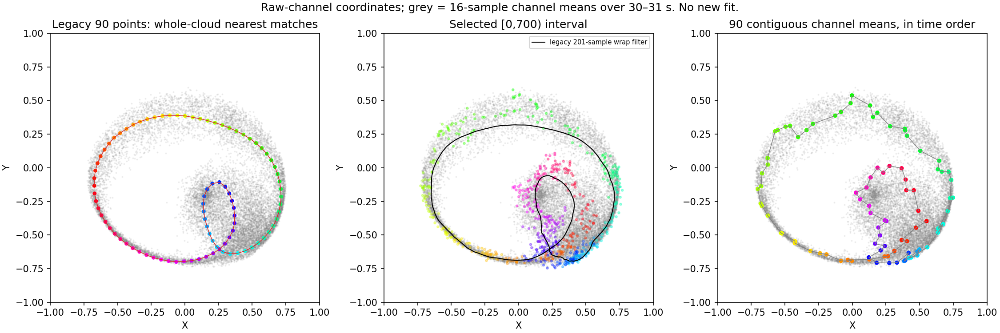
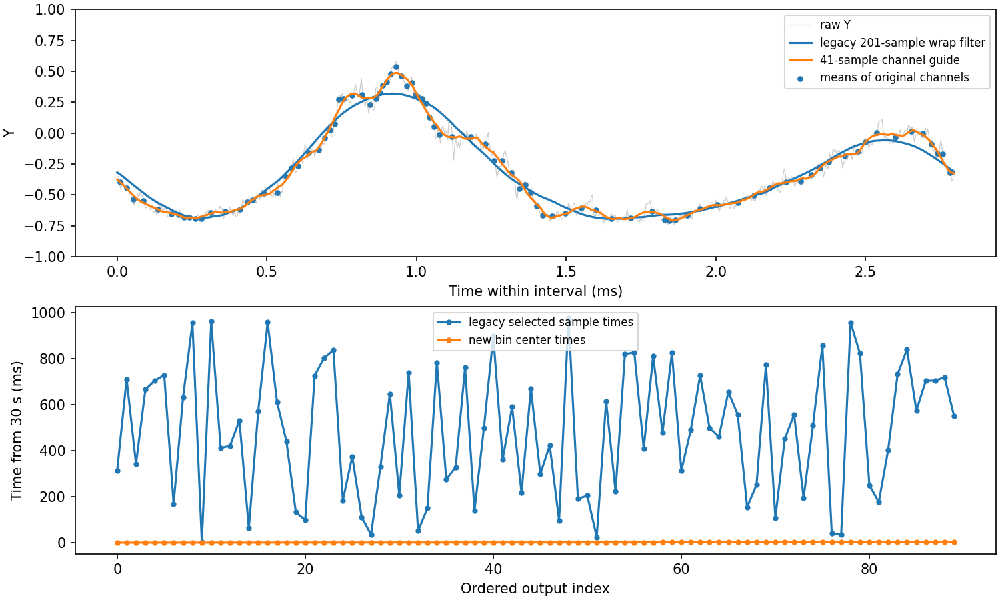

# Pre-fit trajectory audit — 2026-10-05

This review stops before background/interference fitting. It uses the supplied
40 s APD file, the 30–31 s window and the user-selected [0,700) reference (2.8 ms).
The notebook defaults to the new time-ordered path, retaining `legacy_ridge`
for comparison. The archived fits are unchanged; their figures were only
redrawn with both anisotropy axes fixed to [-1,1].

All panels use raw-channel coordinates and the same frame. Grey points are
16-sample channel means over the entire second, not a fitted reference.
Colour follows output order; the legacy order is not acquisition order.

## Main finding

The old reference is visibly distorted before the physical fit. Its 201-sample
periodic Savgol filter spans 0.804 ms, 29% of the selected interval. It lowers
the selected trace's upper Y excursion to 0.319; after spline/ridge/post-smoothing
the archived selected points reach 0.390. Contiguous means of the original
channels reach 0.538. Changing only the new bin-placement guide from 21 to 81
samples gives maxima 0.535–0.538. These extrema are descriptive, not confidence
intervals or proof of the exact noise-free trajectory.

Therefore the previous fitted-cone mismatch cannot yet be attributed exclusively
to interference or calibration. Preprocessing itself changes the shape.

## Audit of the old construction

- Data mapping is consistent with the supplied convention: ai0=90, ai1=45,
  ai2=135, ai3=0. All four channels have 10 million samples and matching 4 us
  increments/zero offsets, and report Volts. No photon-count assumption is used.
- Manual cycle bounds previously still ran the expensive automatic detector
  first. This is now skipped. The slider message also pointed to the wrong
  section: rebuilding requires Sections 7–9, not just Section 9.
- Automatic detection counts spatial neighbours between windows, rather than
  verifying ordered recurrence. It can confuse a crossing, one pass or two
  passes. The right edge of a recurrence peak is not an exact cycle boundary.
  It remains an optional legacy candidate generator, not a verified period.
- Periodic filtering and splines impose closure. The selected interval's
  independently constructed 41-sample channel guide has endpoint gap 0.0944
  and open length 6.895. This gap is a diagnostic, not proof of an incomplete
  revolution: endpoint noise and filtering also contribute.
- Spatial SCMS and nearest-ridge snapping do not carry branch identity. The
  pooled density also reflects residence time and the current speed distribution.
- The final nearest match is a search over all 250,000 points in the second.
  The archived 90 selections span 3.828–975.872 ms from the window start and
  have 39 backward time steps. Such mixing is not intrinsically wrong for a
  stationary phase-averaged curve, but the method does not verify phase/branch
  equivalence or average channels. A near-zero distance only shows that points
  exist near the already constructed reference. It does not validate that curve.
- `FORCE_UNIQUE` prevents sample reuse but cannot solve branch ambiguity.
- Invalid anisotropy denominators formerly became zeros, creating fake origin
  points. They now remain NaN and stop pre-fit extraction with an explanation.
- With `use_tmatrix=False`, the old automatic gain fit still used the optical
  matrix. Re-enabling the toggle could also leave the application matrix as
  identity. Both behaviours are fixed; numerical optical coefficients/signs
  and the gain-fitting objective are otherwise unchanged.

## Simpler default

1. Select a contiguous interval containing the full intended trajectory.
2. Lightly smooth the four channels only to build an open arc-length guide.
3. Partition the interval into 90 contiguous, non-overlapping bins, approximately
   even in guide arc length. Average the original four channels in each bin.
4. Preserve those bins in acquisition order. No spatial snap, spatial nearest
   match, periodic spline or forced closure is used.

Every one of the 700 samples contributes once. The bins here contain 2–20
samples; counts and boundaries are retained. This preserves two separate visits
to the same XY location, including different brightness at those visits. The
channel average is formed before taking ratios. Fixed linear calibration
commutes with that average; a calibration estimated anew from different selected
data does not. Hold gains fixed when comparing physical fits.

This is a more transparent diagnostic reference, not a claim that one short
interval is statistically sufficient. The points are visibly noisier than the
legacy smooth curve, and a fast-moving region has fewer samples per bin. Finite
bins average motion. Neither bin counts nor within-bin scatter by themselves
give independent noise uncertainties for bandwidth-limited APD data.

## What remains before a new physical fit

- Check additional complete time intervals and align them with order-preserving
  time warping if more averaging is needed. Preserve all four channel values and
  branch ordering during alignment; do not pool by XY nearest neighbour alone.
- Check endpoint compatibility and sensitivity to the reference interval.
- Review the shape-fit objective. Arc-length resampling of a noisy polyline can
  overweight noise excursions; fixing the leftmost anchor can also jump between
  visits. A cyclic, order-preserving alignment or channel likelihood is preferable
  to a one-sided nearest-curve distance. The historical fit also has a
  background-dependent positivity mask; that should not become a way to drop
  difficult samples. These fit changes are deliberately outside this audit.
- An unparameterized curve cannot distinguish identical repeated traversals.
  A one/two-pass flag can specify the assumed multiplicity, but does not recover
  phase information absent from the measurements. The new method preserves time
  order without needing such a flag. It still needs a suitable interval.
- The anisotropy argument is 2*lab_phi, not twice the mechanical cone phase.
  One half mechanical revolution need not be a complete XY loop for a tilted
  cone. No universal mechanical-period rule is imposed here.

## Verification and reproduction

`python analysis/pupil_comparison/verify_preprocessing.py` checks two coincident
turns with different brightness, a self-crossing variable-speed trace, a known
dipole cone, all-sample coverage, invalid pair sums, actual notebook pre-fit
execution, and toggling the T correction with manual/automatic gains.

`python analysis/pupil_comparison/audit_preprocessing.py` generates these plots
and metrics from the raw sample and archived outputs, without optimization.

